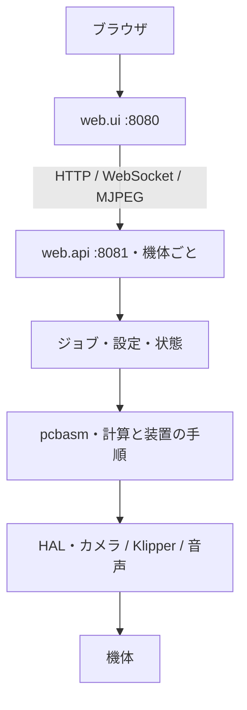

# アーキテクチャ

[ドキュメント一覧](../README.md) · [開発への参加](../CONTRIBUTING.md)

装置制御の Python コアと、2 つの FastAPI プロセスで構成する。
機体固有の状態は backend に集め、frontend は LAN 上の複数 backend を切り替えて表示する。

## 責務と変更先

| 配置                                | 責務                                                         |
| ----------------------------------- | ------------------------------------------------------------ |
| `src/pcbasm/geometry/`              | 座標変換、ポリゴン、経路、配置の計算                         |
| `src/pcbasm/pcb/`                   | KiCad 読込・生成、パッド、footprint、単位変換                |
| `src/pcbasm/vision/`                | カメラ校正、画像・銅箔・塗布点の検出                         |
| `src/pcbasm/hal/`                   | カメラ、Klipper、ステージ、ディスペンサー、音声の抽象と実装  |
| `src/pcbasm/posctrl/`               | 基板の位置合わせ、基準点、補正、カメラと装置の座標対応       |
| `src/pcbasm/pasting/`               | 塗布の設定解決、経路、高さ面、機械手順、画像収集、塗布量校正 |
| `src/pcbasm/visualization/`         | PCB・塗布経路・高さ面・校正結果の描画                        |
| `src/pcbasm/pnp/`                   | 部品実装向けの予約された名前空間。未実装                     |
| `src/web/api/routers/`              | HTTP 入出力とコア呼び出し、例外から HTTP 応答への変換        |
| `src/web/api/jobs/`                 | 長時間処理、進捗、中断、操作者への質問、成果物の公開         |
| `src/web/ui/`                       | マシン探索・選択、SSR ページ、backend への中継               |
| `src/web/ui/templates/` / `static/` | HTML、CSS、DOM 操作、API 応答の表示                          |
| `src/web/selfupdate/`               | backend / frontend 共通の Git 更新とサービス再起動手順       |
| `scripts/`                          | ホストのセットアップとサービス運用                           |

`pcbasm` は `web` を import しない。ジョブの画面や API が変わっても、
位置合わせや塗布計画の計算はコア層で検証できるようにする。
塗布ドメイン内の詳細は [pasting の構成](../src/pcbasm/pasting/README.md) を参照する。

## リクエストとジョブ

ページは `/m/{machine_id}/…`、機体の API は `/m/{machine_id}/api/…` を使う。
frontend の `MachineClient` が backend から表示用のモデルを取得し、
`pages.py` が `layout.py` の表示定義に従ってテンプレートへ渡す。
API の中継は `proxy.py` が担当する。

装置の状態、実効設定値、集計値は backend が返す。
frontend と JS はそれらを再計算しない。たとえばパッドの設定を編集したら、
サーバーが解決した応答か再取得した値で画面を更新する。

ジョブの公開名とパラメータは backend のカタログが管理する。
ジョブは `JobContext` を通じてログ・進捗・プロンプトを配信する。
装置への変更操作は backend の操作権で調停され、閲覧者も緊急停止と中止を実行できる。
UI のボタン無効化だけに依存しない。

## 設定とデータの所有者

| データ                                  | 既定の場所                          | 所有者                                      |
| --------------------------------------- | ----------------------------------- | ------------------------------------------- |
| 機体の設定・カメラ校正                  | `config/`                           | backend。Git 管理外                         |
| Klipper 設定の実体                      | `~/printer_data/config/printer.cfg` | Klipper。`config/printer.cfg` はリンク      |
| 静的な機体登録                          | `config/machines.toml`              | frontend が起動時に読む                     |
| 選択 PCB・基板別 override・ジョブ成果物 | `data/webui/`                       | backend                                     |
| 塗布画像データセット                    | `data/paste-volume-datasets/`       | backend                                     |
| 塗布量校正                              | `data/paste-volume-calibrations/`   | backend。再現に必要な校正資産               |
| 自己更新の記録・ロック                  | `data/selfupdate/`                  | 同じ worktree の backend と frontend が共有 |

PCB の閲覧・アップロード先も backend 機のファイルシステムである。
frontend 専用ホストは機体の `machine.toml` を読まない。
環境変数による場所の変更は [WebUI の環境変数](webui.md#%E7%92%B0%E5%A2%83%E5%A4%89%E6%95%B0) を参照する。

永続ファイルの構造を変える場合は既存データの読込・移行を扱う。
ディレクトリ名だけを変更すると運用データが孤立するため、見た目だけの改名は行わない。
`data/testing/` のテスト資産と `data/config-templates/` の初期設定を実機データと混同しない。
